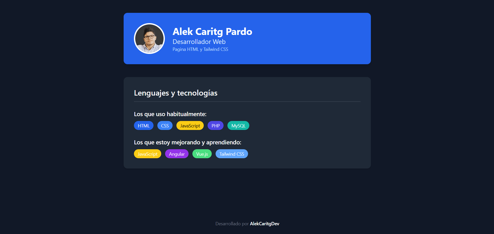

# Página Personal - HTML + Tailwind CSS

 
 

---

## Descripción

**Página Personal - TailwindCSS** es un proyecto web sencillo desarrollado con el objetivo de **practicar y afianzar conocimientos en Tailwind CSS** y estructura básica con HTML.

La página incluye:

- 📷 Mi nombre y fotografía personal.  
- 💼 Una pequeña presentación sobre mi rol como desarrollador.  
- 💻 Listado de tecnologías que uso actualmente.  
- 🔧 Sección de tecnologías que estoy aprendiendo.

Todo el diseño ha sido construido **sin escribir CSS personalizado**, únicamente utilizando las clases de utilidad de **TailwindCSS**.

---

## Objetivo del proyecto

- Practicar el uso de **Tailwind CSS** y sus clases utilitarias.
- Mejorar la estructura y organización del contenido.
- Desarrollar un diseño **moderno y responsive**.

---

## Tecnologías utilizadas

| Lenguaje | Framework / Librería |
|----------|-----------------------|
| HTML5    | Tailwind CSS (CDN)    |

---

## Capturas de pantalla

| Pagina Web                          |
|-------------------------------------|
|  |

---

## 💡 ¿Tienes ideas o retos?

Me encantaría que me propusieras **nuevos retos o ideas de páginas web** para seguir practicando.  
🔗 Las iré subiendo a mi GitHub: [github.com/AlekCaritgDev](https://github.com/AlekCaritgDev)

Acepto ideas con cualquier tecnología: **Tailwind, Vue, Angular, JS, etc.**  
¡Intentaré hacerlas y cumplir los retos! 💪

---
